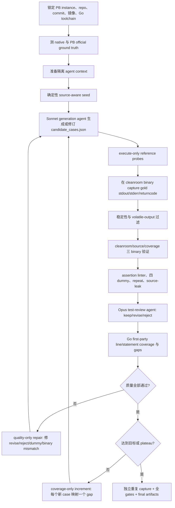

# ProgramBench-style Gym：完整实验结果与当前 Workflow

> 文档日期：2026-07-15
> 当前实现范围：Go CLI repositories
> 主源码仓库：`C:\Users\v-haominqi\Documents\Codex\pb-scaffold`
> WSL 运行仓库：`/home/programbench/research/programbench-scaffold`
> 正式实验根目录：`/home/programbench/research/oracle-workspace`

## 1. 结论先行

当前工作的目标不是复刻 ProgramBench 的已有 oracle tests 内容，而是复现论文所描述的 **oracle test 产生、覆盖率反馈、质量过滤和 cleanroom 验证范式**，独立产生尽可能接近或达到 PB 官方 oracle 质量的 behavioral tests。

截至 2026-07-15，repo 数量必须按以下三个口径解释：

1. **46 个 Go repo/instance 做过 seed-only 工程基线扫描**。这轮没有调用生成 agent，也跳过了 reviewer，主要验证数据加载、reference capture、三 binary、Go coverage 和确定性过滤能否批量运行。
2. **5 个 repo 被进一步直接诊断或运行**：`sclevine/yj`、`tomnomnom/gron`、`multiprocessio/dsq`、`psampaz/go-mod-outdated`、`rs/jplot`。
3. **2 个 repo 完成正式 agent-led 闭环并被接受**：`sclevine/yj` 和 `tomnomnom/gron`。两者的 Go statement coverage 均达到 PB 官方 oracle，并通过三 binary、一致性、dummy rejection、assertion linter、source-leak scan、重复执行和独立 reviewer。

正式 pilot 的核心结果：

| Repo | Native line / stmt | PB official line / stmt | 我们的 tests | 我们的 line / stmt | Reviewer | 最终状态 |
|---|---:|---:|---:|---:|---|---|
| `sclevine/yj` | 75.9% / 76.2% | 88.5% / 88.8% | 143 | **88.9% / 89.7%** | 143 keep | `accepted_target_coverage` |
| `tomnomnom/gron` | 70.9% / 70.2% | 92.9% / 93.3% | 100 | **92.9% / 93.5%** | 100 keep | `accepted_target_coverage` |

这说明当前 workflow 已经在两个 Go CLI repo 上完成从 source-aware generation 到 PB-style filtering 的闭环，但还不能据此宣称对所有 Go repo 普遍有效。其余 PB repo 仍必须逐个完成自己的 oracle generation；official oracle 不稳定、native coverage 已高或环境复杂只决定要先补哪种 adapter/过滤能力，不是跳过 repo 的理由。

## 2. 研究目标与边界

### 2.1 短期目标

- 在 Linux/WSL + Docker cleanroom 环境中复现 ProgramBench oracle-test workflow。
- 从 Go 开始，获得 official oracle、repo native tests、我们的 generated tests 三组可比数据。
- 用 `go build -cover -coverpkg=./...` 构建 coverage binary，测量 first-party statement coverage 和 executable-line coverage。
- 每个 candidate test 必须在 cleanroom/reference binary 上建立 gold behavior，并在 source-built、coverage-built binary 上行为一致。
- 用确定性 gates 和 test-review agent 删除或修正弱断言、dummy-passing、非确定性、泄露源码或 binary-inconsistent tests。
- 以 coverage gaps 作为 agent 下一轮的明确反馈，直到达到目标、质量 plateau 或预算耗尽。

### 2.2 长期目标

路线为：

`实现标准筛选范式 → 在 PB 原始实例运行 → 新实例运行 → 环境搭建与外部 GitHub repo 筛选 → PB 外部 repo 运行 → sampling → reward/SlimRL → 训练 agent → 改善 ProgramBench 及潜在泛化任务表现`

之后语言范围将扩展到 C++、Rust 等 compiled-language repositories。当前 Go 实现是 gym 的第一个可验证 slice，而不是最终语言边界。

### 2.3 防作弊边界

- 生成 target repo 的 oracle 时，**绝不向 agent 提供该 target 的 PB 官方 oracle tests**。
- Agent 可以看到 target source、docs、native tests、testdata、execute-only reference binary、coverage gaps。
- `./example` 只能来自 **不同实例、同语言** 的 one-shot example；例如 gron 使用 yj 的风格示例。
- 官方 oracle 仅由实验控制层用于 ground-truth 评估，不能进入 target agent context。
- `programbench_prepare_pb_style_go_agent_pack.py` 负责制作受控上下文；最终还运行 source-leak scan。

## 3. 实验环境与当前运行状态

### 3.1 环境位置

| 用途 | 路径 |
|---|---|
| Windows 主源码 | `C:\Users\v-haominqi\Documents\Codex\pb-scaffold` |
| Windows 研究入口 | `C:\Users\v-haominqi\Documents\Codex\ProgramBenchResearch\README.md` |
| WSL scaffold | `/home/programbench/research/programbench-scaffold` |
| WSL 官方 ProgramBench | `/home/programbench/research/programbench` |
| 正式实验 workspace | `/home/programbench/research/oracle-workspace` |
| 历史交付物 | `C:\Users\v-haominqi\Documents\Codex\2026-07-13\harminchee-programbench-scaffold-https-github-com\outputs` |

### 3.2 Agent/API

- Agent Maestro extension：`joouis.agent-maestro@2.10.0`。
- Windows 入口：`http://127.0.0.1:23333`，当前端口正常监听。
- Anthropic endpoint：`http://127.0.0.1:23333/api/anthropic`。
- OpenAI Responses endpoint：`http://127.0.0.1:23333/api/openai/v1`。
- 2026-07-15 无费用 catalog 查询成功，包含 `gpt-5.3-codex`、`claude-sonnet-5`、`claude-opus-4.8`。
- 正式 generation model：`claude-sonnet-5[1m]`；review model：`claude-opus-4.8`。
- key 由 Windows DPAPI 恢复，只报告 `key_present=true`；不得写入 WSL、命令行、日志或仓库。

### 3.3 当前是否有实验在运行

2026-07-15 检查时：

- Agent Maestro 仍在 `127.0.0.1:23333` 监听。
- 没有正在运行的 `programbench_agent_oracle_loop.py`、coverage harness、Claude generation、pytest 或批处理实验进程。
- 所有下述结果均为已完成并落盘的实验，不是正在后台变化的中间值。

### 3.4 当前代码测试状态

对以下三个核心测试文件复核：

- `tests/test_programbench_agent_oracle_workflow.py`
- `tests/test_programbench_assertion_linter.py`
- `tests/test_programbench_cli_fixture_dsl.py`

当前结果为 **29 passed, 1 failed**。唯一失败是 fixture DSL 测试以复制/解析后的 uv Python executable 模拟 reference binary 时，CPython stderr 新增：

`Could not find platform independent libraries <prefix>`

测试仍返回 0 且 fixture 的 file/env/http 行为正常；失败点是测试硬编码要求 `stderr == b""`。这不推翻 yj/gron 已落盘的真实 binary 验证结果，但说明当前开发测试基线不能继续写成旧的“30 passed”，后续应修正该 Python 测试夹具或其 stderr 预期后再恢复全绿。

## 4. 46 个 Go instance 的 seed-only 工程基线

### 4.1 这轮实验是什么、又不是什么

这是一次 **seed-only + skip-review 工程基线**：用确定性 source-aware miner 生成初始 cases，批量跑 capture、coverage 和 quality gates。它验证了 pipeline 的工程吞吐和失败类型，但不是 46 个完整 agent-led oracle generation 实验，因此不能把这些 coverage 当作最终 gym 能力。

汇总：

- Repo/instance：46。
- 初始候选：4,202。
- 通过 reference 稳定性过滤：3,586。
- 被过滤：616。
- 每 repo 稳定用例平均 78.0，中位数 76，范围 2–178。
- 状态：23 个 `seed_ablation_complete`；23 个 `seed_ablation_complete_quality_failed`。
- 生成测试 executable-line coverage：平均 24.365%，中位数 20.9%，最小 0.4%，最大 80.7%。
- 生成测试 statement coverage：平均 23.3%，中位数 19.55%，最小 0.5%，最大 77.8%。
- Native line coverage：41 个有效 repo，平均 59.805%，中位数 70.9%，范围 0–100%。
- Native statement coverage：46 个有效 repo，平均 53.698%，中位数 66.35%，范围 0–100%。
- 所有稳定 suites 均通过 source-leak scan、assertion linter，并能逐 test 拒绝四种 dummy；quality failure 主要来自 generated tests 未全部通过或三 binary 不一致。

### 4.2 全部 46 条明细

| 实例 | 状态 | 稳定 tests | Line | Statement | 生成测试通过 | 三 binary 一致 |
|---|---|---:|---:|---:|---|---|
| `alecthomas__chroma.8d04def` | quality failed | 57 | 23.0% | 21.4% | 否 | 是 |
| `antonmedv__fx.86d0d34` | quality failed | 53 | 15.0% | 11.8% | 否 | 否 |
| `antonmedv__walk.bf802ef` | pass | 4 | 5.7% | 5.9% | 是 | 是 |
| `ariga__atlas.6d81150` | pass | 178 | 2.2% | 1.5% | 是 | 是 |
| `astaxie__bat.17d1080` | pass | 41 | 26.3% | 27.8% | 是 | 是 |
| `boyter__scc.515f91c` | quality failed | 129 | 32.6% | 25.6% | 否 | 是 |
| `cheat__cheat.b8098dc` | pass | 104 | 19.3% | 16.7% | 是 | 是 |
| `cweill__gotests.2a672c5` | quality failed | 102 | 9.3% | 8.8% | 否 | 是 |
| `direnv__direnv.02040c7` | quality failed | 99 | 14.6% | 13.8% | 否 | 是 |
| `dundee__gdu.ede21d2` | quality failed | 121 | 23.9% | 22.1% | 否 | 否 |
| `eliukblau__pixterm.1a93fd5` | pass | 14 | 11.8% | 13.6% | 是 | 是 |
| `filosottile__age.706dfc1` | quality failed | 122 | 7.7% | 7.6% | 否 | 否 |
| `gabotechs__dep-tree.60a95a2` | quality failed | 67 | 6.4% | 5.4% | 否 | 是 |
| `go-critic__go-critic.9aea378` | quality failed | 123 | 41.4% | 38.4% | 否 | 否 |
| `guumaster__hostctl.d6d9699` | pass | 55 | 19.2% | 11.8% | 是 | 是 |
| `hairyhenderson__gomplate.05eb3aa` | pass | 89 | 30.0% | 30.7% | 是 | 是 |
| `hooklift__gowsdl.2a06cec` | quality failed | 16 | 8.9% | 9.4% | 否 | 否 |
| `incu6us__goimports-reviser.81bd549` | quality failed | 30 | 13.5% | 5.2% | 否 | 否 |
| `jesseduffield__lazygit.1d0db51` | pass | 87 | 0.4% | 0.5% | 是 | 是 |
| `johanneskaufmann__html-to-markdown.3006818` | quality failed | 103 | 42.2% | 41.1% | 否 | 是 |
| `johnkerl__miller.8d85b46` | pass | 146 | 20.3% | 16.2% | 是 | 是 |
| `junegunn__fzf.b56d614` | quality failed | 170 | 23.3% | 21.3% | 否 | 否 |
| `kisielk__errcheck.dacab89` | quality failed | 44 | 24.3% | 25.7% | 否 | 否 |
| `kyoh86__richgo.313114f` | pass | 28 | 35.1% | 26.2% | 是 | 是 |
| `mfridman__tparse.2416b4b` | quality failed | 77 | 47.0% | 43.7% | 否 | 否 |
| `mgechev__revive.201451e` | quality failed | 116 | 21.5% | 21.2% | 否 | 否 |
| `mibk__dupl.1bf052b` | pass | 29 | 29.0% | 25.7% | 是 | 是 |
| `mikefarah__yq.602586d` | quality failed | 174 | 18.0% | 17.5% | 否 | 是 |
| `multiprocessio__dsq.c3ae0ba` | pass | 129 | 37.4% | 38.4% | 是 | 是 |
| `naggie__dstask.ff57396` | pass | 16 | 16.1% | 17.9% | 是 | 是 |
| `noborus__ov.b96c2ba` | quality failed | 168 | 6.4% | 5.2% | 否 | 是 |
| `noborus__trdsql.d8c5ff6` | quality failed | 95 | 23.5% | 21.9% | 否 | 是 |
| `peco__peco.4e58dad` | quality failed | 154 | 23.0% | 22.2% | 否 | 否 |
| `psampaz__go-mod-outdated.bb79367` | pass | 32 | 80.7% | 77.8% | 是 | 是 |
| `raviqqe__muffet.a882908` | pass | 75 | 34.2% | 31.6% | 是 | 是 |
| `rs__curlie.5dfcbb1` | pass | 33 | 47.6% | 51.7% | 是 | 是 |
| `rs__jplot.2a54bcc` | pass | 25 | 9.8% | 10.8% | 是 | 是 |
| `sclevine__yj.8016400` | pass | 145 | 77.0% | 76.8% | 是 | 是 |
| `segmentio__chamber.5f93f5f` | pass | 46 | 3.5% | 3.4% | 是 | 是 |
| `sheepla__pingu.926d475` | quality failed | 21 | 55.6% | 71.4% | 否 | 否 |
| `sibprogrammer__xq.b89f681` | pass | 47 | 51.5% | 50.8% | 是 | 是 |
| `skeema__skeema.6a76243` | pass | 2 | 6.6% | 3.7% | 是 | 是 |
| `thezoraiz__ascii-image-converter.d05a757` | quality failed | 79 | 17.4% | 17.1% | 否 | 是 |
| `tomarrell__wrapcheck.c058da1` | pass | 13 | 16.1% | 14.2% | 是 | 是 |
| `tomnomnom__gron.88a6234` | pass | 29 | 35.2% | 33.7% | 是 | 是 |
| `zk-org__zk.10d93d5` | quality failed | 99 | 7.3% | 6.6% | 否 | 是 |

历史原始汇总：`outputs/programbench_go_agent_runs.{md,csv,json}`；完整 Windows 路径位于本文开头所列历史交付物目录。

## 5. 5 个直接诊断 repo 的完整结果

| Repo | 运行层级 | 关键 ground truth / 结果 | 是否正式接受 |
|---|---|---|---|
| `sclevine/yj` | 完整 agent pilot | ours 143 tests，88.9% line / 89.7% stmt；official 88.5% / 88.8% | 是 |
| `tomnomnom/gron` | 完整 agent pilot | ours 100 tests，92.9% / 93.5%；official gold-filtered 92.9% / 93.3% | 是 |
| `multiprocessio/dsq` | official ground-truth 诊断 | official 542 active refs，88.3% / 91.4%，但一个 exact JSON map-order test 在 coverage binary 失败 | 否 |
| `psampaz/go-mod-outdated` | official ground-truth 诊断 | official 与 native 都是 100% / 100%；一个 official branch 在 source/coverage binary 各失败 1 test | 否 |
| `rs/jplot` | official ground-truth 诊断 | official 77.9% / 81.1%，但 TUI/HTTP/graphics branch 无法稳定通过，另有 pytest collection/运行失败 | 否 |

### 5.1 yj 正式 pilot

- Instance：`sclevine__yj.8016400`。
- Commit：`80164002c0d7f88aa58fa5bec8a8cf4f1bb4e93b`。
- Native：6 个 Go test functions，75.9% line / 76.2% statement，覆盖 651/858 executable lines。
- PB official：9 个 branches，825 个 test references，806 个 unique test names；88.5% line / 88.8% statement，覆盖 759/858 lines。
- Strict deterministic seed：151 tests，77.0% line / 76.8% statement；17 个 dummy-passing，因此判定 quality failed。
- Agent final：143 tests，88.9% line / 89.7% statement；三 binary 一致；lint high/medium/low 全 0；dummy-passing 0；repeat return code 0；source leak pass；reviewer 143 keep。
- 迭代轨迹：137 tests / 87.6%（全 keep）→ 142 / 88.9%（1 revise）→ 143 / 88.9%（全 keep）。
- 目标：88.5%；最终状态：`accepted_target_coverage`。
- Final：`/home/programbench/research/oracle-workspace/pilots/yj_pb_groundtruth_20260714_v22/experiments/runs/sclevine__yj.8016400/final/`。

### 5.2 gron 正式 pilot

- Instance：`tomnomnom__gron.88a6234`。
- Commit：`88a6234ea2d0c487090988182ad9a7cdf6def924`。
- Native：70.9% line / 70.2% statement。
- PB official 原始集合包含 233 个 tests：9 个 metadata ignored；另有 4 个 gold-failing tests 被剔除，得到 220 个 gold-filtered tests。
- PB official gold-filtered：220 tests，92.9% line / 93.3% statement。
- Agent final：100 tests，92.9% line / 93.5% statement；仅用官方 test function 数的约 45.5%，达到相同行覆盖率。
- 迭代轨迹：96 / 92.0%（94 keep、1 revise、1 reject）→ 95 / 92.0%（全 keep）→ 99 / 92.7% → 100 / 92.9%。
- Final gates：100/100 tests pass，三 binary 一致，lint 全 0，dummy-passing 0，source leak pass，reviewer 100 keep。
- 独立 final validation：reference determinism capture 8 次，再重跑 cleanroom/source/coverage 三 binary 与全部质量门禁，仍为 100 tests、92.9% line / 93.5% statement。
- 目标：92.9%；最终状态：`accepted_target_coverage`。
- Final：`/home/programbench/research/oracle-workspace/pilots/gron_agent_20260714_v6_reject_fix/experiments/runs/tomnomnom__gron.88a6234/final/`。
- 独立复验：`/home/programbench/research/oracle-workspace/pilots/gron_final_validation_20260714/`。

### 5.3 dsq：官方 oracle 自身存在非确定性

- Instance：`multiprocessio__dsq.c3ae0ba`；commit `c3ae0bafb0c3283e3c98cb250ada5a19e79ad58e`。
- 10 个 official branches；766 expected references，224 ignored，542 active。
- 合并 coverage：88.3% line / 91.4% statement。
- Branch `8113a2d033e3`：cleanroom 与 source 通过；coverage binary 的 14 tests 中失败 1 个。
- 失败源于 exact JSON key order，而 Go map iteration order 非确定。对该 exact test 在三 binary 各串行重复 8 次，均出现 0/8 稳定通过的证据，说明问题来自官方 oracle 的不确定假设，不应把该 repo 当作 clean gold target。
- 结论：保留为筛选反例，不进入正式 agent pilot 结果。

### 5.4 go-mod-outdated：没有 coverage 提升空间

- Instance：`psampaz__go-mod-outdated.bb79367`；commit `bb79367d102a05221196613dde574f1a0b81b556`。
- 8 个 official branches；341 expected，56 ignored，285 active。
- Official：100.0% line / 100.0% statement；native：100.0% / 100.0%。
- Branch `0d7f74667e0b` 的 cleanroom 通过，但 source 与 coverage binary 在 135 tests 中各失败 1 个，因此全量三 binary ground truth 也不是完全 clean。
- 结论：即便修复 branch failure，也没有 native→official coverage improvement 空间，不适合作为验证 coverage-guided agent 的下一个 pilot。

### 5.5 jplot：TUI/HTTP/graphics 环境不稳定

- Instance：`rs__jplot.2a54bcc`；commit `2a54bccf26d9cb644ec987994123cf20683fa75b`。
- 8 个 official branches；722 expected，139 ignored，583 active。
- Official 合并 coverage：77.9% line / 81.1% statement；native coverage profile 无有效 executable lines，记录为 0.0% statement / line unavailable。
- `44e825850131` branch 在三 binary 均 return code 4，JUnit 未生成；此前还观察到 TUI/HTTP/graphics 相关失败与 timeout。
- 结论：当前 cleanroom/fixture 支持还不足以把它作为正式 agent pilot。

## 6. 当前完整 Workflow



### Step 0：锁定实例与可复现环境

输入是 PB `instance_id`，从 `task.yaml` 读取 repository、commit、language 和 cleanroom image。源码必须 checkout 到 pinned commit，Go toolchain 按实例兼容性选择。每次实验使用新的 workspace，不复用被污染的 build/test 目录。

主要脚本：

- `tools/programbench_agent_oracle_loop.py`：读取 task metadata 并建立 run root。
- `tools/programbench_go_coverage_harness.py`：解析 source、build target、Go toolchain 和官方 test branches。
- `setup/programbench_wsl_bootstrap.sh`：WSL、Docker、Python/Go 依赖 bootstrap。
- `setup/initialize_programbench_research_workspace.py`：建立研究目录布局。

### Step 1：先测 ground truth，不让 agent 看官方答案

对同一 pinned commit 测三组 suite：repo native tests、PB official oracle、我们的 generated tests。Official oracle 只在控制层用于得到 target coverage 和筛查 PB 自身的不稳定 tests，不复制进 target agent workspace。

输出：test-function/reference 数、ignored/gold-failing 数、statement coverage、executable-line coverage、per-file coverage、三 binary pass/一致性。

主要脚本：`tools/programbench_go_coverage_harness.py`。

### Step 2：准备隔离的 agent context

把 target source、README/docs、native tests、testdata 和 task metadata放入 `agent_workspace/source`；另放一个不同实例同语言的 example。目标官方 oracle 不进入上下文。

主要脚本：`tools/programbench_prepare_pb_style_go_agent_pack.py`。

### Step 3：建立 source-aware seed

在第一次模型调用前，从 CLI flags、subcommands、源码分支、native tests 和 testdata 提取确定性初始 cases。Seed 的意义是给 agent 一个可执行起点，并支持 seed ablation；它不是最终答案。

主要脚本：`tools/programbench_generate_source_aware_cli_cases.py`。

### Step 4：generation agent 生成完整 candidate suite

主编排器通过 Agent Maestro 调用 `claude-sonnet-5[1m]`。Agent 必须返回/写出完整 `candidate_cases.json`，不是只给自然语言建议。每轮都保留已有 keep cases，按阶段修订：

- 质量未过：只修 reject/revise、dummy-passing、binary-inconsistent cases，不做 coverage 扩张。
- 质量已过：coverage-only increment；每轮最多增加 16 cases、最多 20 次 reference probes，每个 case 必须在 rationale/name 中映射到一个明确 coverage gap。

主要脚本：

- `tools/programbench_agent_oracle_loop.py`：构造 prompt、迭代、checkpoint、停止条件。
- `tools/programbench_agent_provider.py`：Claude Code 与 Agent Maestro provider 封装。
- `setup/run_claude_code_via_agent_maestro_noninteractive.ps1`：Windows 非交互模型入口。

### Step 5：受限 reference probing

Agent 只能执行 reference binary，不能读取或反编译它。Probe 接受 args、stdin、env、files、local HTTP fixture 和 timeout；结果用于理解黑盒行为和修正 candidate。

主要脚本：

- `tools/programbench_agent_probe_reference.py`
- `tools/programbench_agent_probe_reference_windows.ps1`
- `tools/programbench_agent_validate_cases_windows.ps1`

### Step 6：Candidate fixture DSL

每个 case 至少包含：

- `name`、`area`
- `args`、`stdin`
- `origin`、`rationale`

可选支持：

- `env`：受控环境变量。
- `files`：临时目录内的安全相对路径 fixture。
- `http`：本地 loopback HTTP response fixture，并通过 `{http_url}` 注入。
- `stdout_mode: lines_unordered`：仅用于语义确实无序的输出；默认 exact。

Capture 后每个 case 生成一个独立 pytest test function，并保存 stdout、stderr、stdin、return code、timeout、fixture hashes。

主要脚本：`tools/programbench_generate_cli_oracle_bundle.py`。

### Step 7：在 cleanroom/reference binary 上 capture gold behavior

从 PB image materialize `/workspace/executable`，在隔离临时目录逐 case 执行，记录 exact outputs。默认过滤 timed-out、volatile-output 和 nondeterministic cases。普通迭代会做多次 determinism rerun；最终高风险复验可增加到 8 次。

主要脚本：`tools/programbench_generate_cli_oracle_bundle.py`。

### Step 8：三 binary 一致性

同一批 tests 必须在三个 binary 上得到一致的测试名称、通过/失败/跳过计数和行为：

1. **Cleanroom binary**：PB Docker image 中提供给 agent 的 reference executable。
2. **Source-built binary**：从 pinned source 用普通 `go build` 构建。
3. **Coverage binary**：同一 source 用 `go build -cover -coverpkg=./...` 构建。

每个 binary 使用 fresh pytest workspace，避免输出文件或缓存互相影响。任一 binary 不一致都反馈具体 case name 给 agent 修订。

主要脚本：`tools/programbench_go_coverage_harness.py`。

### Step 9：确定性质量门禁

质量门禁按 PB paper Appendix A.3.5 / Table 8 思路实现：

- Assertion linter：无 assertion、只看 return code、过短 substring、`A or B`、吞异常、只看文件存在不看内容等弱模式。
- Dummy rejection：`true`、`cat-stdin`、`false`、`empty-stderr` 四种 dummy 分别运行；要求 **每个 test 都拒绝每个 dummy**。
- Gold repeat：在 coverage executable 上再运行完整 suite。
- Source-leak scan：检查 oracle material 是否泄露 target source/官方答案。

主要脚本：

- `tools/programbench_run_generated_oracle_quality_gates.py`
- `tools/programbench_assertion_linter.py`

### Step 10：独立 test-review agent

确定性 gates 之后，Opus reviewer 根据 case、reference observations、quality evidence 和 coverage 逐 test 给 `keep/revise/reject`。Reviewer 必须覆盖每个 test；遗漏采用 fail-closed。只有全 keep 才能进入 coverage-only 扩张或最终接受。

主要脚本：`tools/programbench_test_review_agent.py`；正式循环中的 batched review 由 `tools/programbench_agent_oracle_loop.py` 调用。

### Step 11：Go coverage 与 gap feedback

Coverage binary 写入 `GOCOVERDIR`，随后使用 `go tool covdata` 与 `go tool cover -func` 合并并分析：

- first-party statement coverage；
- executable-line coverage（根据 Go cover profile block line union 近似 PB line coverage）；
- per-file coverage；
- 未覆盖/低覆盖函数和行，作为下一轮 agent 的结构化 `coverage_gaps`。

主要脚本：`tools/programbench_go_coverage_harness.py`。

### Step 12：单轮 pipeline

单轮顺序固定为：

`cases → reference capture → pytest bundle → Go coverage/三 binary → quality gates → pipeline_summary.json`

主要脚本：`tools/programbench_run_pb_style_go_oracle_pipeline.py`。

注意：coverage harness 因行为不一致返回 non-zero 时，只要已生成结构化 summary 和 executable，就继续运行 quality gates，把失败当作修复证据，而不是立刻误判为基础设施中断。

### Step 13：迭代、checkpoint 与停止条件

`tools/programbench_agent_oracle_loop.py` 维护完整 history 和反馈：

- `gates_ok && reviewer all keep && statement coverage >= PB gold-filtered official target` → `accepted_target_coverage`。
- 连续覆盖提升小于 `plateau_delta`，达到 `plateau_patience` → `incomplete_quality_plateau`；保存 best-quality suite，但不算正式成功。
- 预算耗尽时只回退到历史上的 `best_quality` checkpoint；不会把质量失败但 coverage 更高的 suite 当 final。
- Generation agent 达到 max turns 时，只允许恢复其已经写到磁盘的 candidate；恢复结果仍必须通过全部 gates 和 reviewer。
- Provider/transport/timeout 异常 fail-closed，记录 `blocked_*`，不伪装成实验失败或成功。

### Step 14：最终独立复验与 artifacts

最终 suite 至少包含：

- `final/candidate_cases.json`
- `final/run_summary.json`
- 每轮 `pipeline_summary.json`
- coverage summary、raw profiles、JUnit、quality report
- generation/review manifests、evidence、validated review
- capture fixtures 与 hashes

正式结果还应在新的 workspace 增加 determinism reruns，并重跑三 binary 与全部 gates。gron 已完成 8 次独立复验。

## 7. 脚本总表

| 阶段 | 脚本 | 职责 |
|---|---|---|
| API key | `setup/initialize_agent_maestro_api_key.ps1` | 从 Windows DPAPI 初始化/恢复现有 key；禁止打印 key |
| Anthropic API | `setup/invoke_agent_maestro_anthropic.ps1` | 通过 Maestro Anthropic endpoint 发起受控请求 |
| Claude 交互 | `setup/start_claude_via_agent_maestro.ps1` | 启动指定 Sonnet/Opus Claude Code 会话 |
| Claude 非交互 | `setup/run_claude_code_via_agent_maestro_noninteractive.ps1` | generation agent 的 Windows 非交互入口 |
| WSL bootstrap | `setup/programbench_wsl_bootstrap.sh` | Linux、Docker、Python、Go 与研究运行环境 |
| 研究目录 | `setup/initialize_programbench_research_workspace.py` | 初始化 WSL research workspace |
| Agent pack | `tools/programbench_prepare_pb_style_go_agent_pack.py` | 构造 target source/docs/native/example 的无泄露 context |
| Seed | `tools/programbench_generate_source_aware_cli_cases.py` | 从源码与已有材料生成确定性初始 CLI cases |
| Agent provider | `tools/programbench_agent_provider.py` | Claude Code generation 与 Maestro review provider |
| 主循环 | `tools/programbench_agent_oracle_loop.py` | generation→gates→review→coverage feedback→stop 的总编排 |
| Probe | `tools/programbench_agent_probe_reference.py` | execute-only reference probe，支持 fixture DSL |
| Windows probe | `tools/programbench_agent_probe_reference_windows.ps1` | Windows/WSL 边界的受控 probe 调用 |
| Candidate validation | `tools/programbench_agent_validate_cases_windows.ps1` | 从 Windows 验证候选 case schema/执行 |
| Gold capture | `tools/programbench_generate_cli_oracle_bundle.py` | reference capture、稳定性过滤、pytest/fixtures 生成 |
| Coverage | `tools/programbench_go_coverage_harness.py` | native/official/generated coverage、构建三 binary、行为比较 |
| Linter | `tools/programbench_assertion_linter.py` | PB Table 8 风格弱 assertion 静态检查 |
| Quality gates | `tools/programbench_run_generated_oracle_quality_gates.py` | linter、四 dummy、repeat、source-leak 汇总 |
| Reviewer | `tools/programbench_test_review_agent.py` | Opus 对每个 test keep/revise/reject |
| 单轮 pipeline | `tools/programbench_run_pb_style_go_oracle_pipeline.py` | capture→coverage→quality 的可复用单轮 |
| Batch | `tools/programbench_run_go_agent_batch.py` | 选择多个 Go instances、并发/恢复/infra retry；正式研究暂不盲目全量 |
| 汇总 | `tools/programbench_summarize_go_agent_runs.py` | 聚合 run summaries，输出 MD/CSV/JSON |

## 8. 如何运行一个新的正式 Go pilot

先在 Windows 同一个 PowerShell 安全注入 key，然后从 WSL repository 调用主循环。以下命令不包含任何 key：

```bash
cd /home/programbench/research/programbench-scaffold

.venv/bin/python tools/programbench_agent_oracle_loop.py INSTANCE_ID \
  --tasks-root /home/programbench/research/programbench/src/programbench/data/tasks \
  --workspace-root /home/programbench/research/oracle-workspace/pilots/NEW_PILOT \
  --example-instance-id sclevine__yj.8016400 \
  --generation-model 'claude-sonnet-5[1m]' \
  --review-model 'claude-opus-4.8' \
  --target-coverage OFFICIAL_GOLD_FILTERED_LINE_COVERAGE \
  --max-iterations 8 \
  --max-turns 24 \
  --agent-timeout 1800 \
  --overwrite
```

但不能直接对任意 repo 启动此命令。必须先完成：

1. 官方 oracle gold-pass 与 determinism 诊断。
2. 三 binary ground truth 一致性。
3. Native 与 official coverage 差距评估。
4. CLI/fixture/cleanroom 适配性判断。
5. 选择不同实例的同语言 example。

## 9. 当前已实现的关键改进

- 加入 `./example`，但严格限定为不同 target instance，避免答案泄露。
- 加入独立 Opus test-review agent，并要求逐 test 完整判定。
- 修复 reviewer reject merge：reject 必须真正从下一轮 suite 删除。
- 将 quality repair 与 coverage expansion 分阶段，避免为追 coverage 保留弱 tests。
- 将 dummy gate 从“suite 能拒绝 dummy”加强为“每个 test 都拒绝每个 dummy”。
- 加入 source leak scan、三 binary fresh workspace、一致 test-name hash。
- Coverage gaps 结构化反馈给 generation agent。
- 引入 best-quality checkpoint、plateau 与 max-turn recovery。
- Fixture DSL 支持 files/env/local HTTP 与显式 unordered-line semantics。
- 对 gron 完成 8 次独立 final determinism capture。

## 10. 已知限制与下一步

### 当前限制

- 目前正式成功样本只有 2 个，尚不足以证明跨 repo 普遍性。
- 当前主循环只支持 Go；C++/Rust adapter 尚未实现。
- TUI、图形协议、复杂网络/服务型 CLI 的 fixture 支持仍有限，jplot 已暴露该问题。
- PB 官方 oracle 并非天然都是 gold/deterministic；dsq、go-mod-outdated、jplot 说明 repo selection 必须先做 ground-truth filtering。
- Go executable-line coverage 是基于 cover block line union 的近似指标，必须同时保留 statement coverage 和 profile artifacts。
- 当前开发测试有 1 个 Python fixture stderr 兼容性失败，需要修复后恢复 30/30。

### 推荐下一步

1. 先修复 fixture DSL 的 Python executable/stderr 测试兼容性，恢复核心测试全绿。
2. 从 46 个 seed baseline 中筛选下一个 Go repo：official gold-pass、三 binary 一致、native→official gap 大、CLI fixture 简单。
3. 只运行一个第三 pilot；遇到工程或质量问题先迭代 workflow，不立即铺开多 repo。
4. 为每个正式 pilot固定输出 official/native/ours 的 test count、line、statement、dummy、review、determinism 和三 binary表。
5. 在至少数个异质 Go repo 稳定后，再开启 controlled batch；之后抽象 language adapter，扩展 C++/Rust。
6. 最终把 accepted/rejected cases、coverage increments、review evidence、失败类型和 agent trajectories 转换为可用于 sampling、reward modeling 和 SlimRL 的训练数据。

## 11. 结果证据索引

| 内容 | 路径 |
|---|---|
| 46 repo 汇总 MD | `C:\Users\v-haominqi\Documents\Codex\2026-07-13\harminchee-programbench-scaffold-https-github-com\outputs\programbench_go_agent_runs.md` |
| 46 repo CSV | `C:\Users\v-haominqi\Documents\Codex\2026-07-13\harminchee-programbench-scaffold-https-github-com\outputs\programbench_go_agent_runs.csv` |
| 46 repo JSON | `C:\Users\v-haominqi\Documents\Codex\2026-07-13\harminchee-programbench-scaffold-https-github-com\outputs\programbench_go_agent_runs.json` |
| yj final summary | `/home/programbench/research/oracle-workspace/pilots/yj_pb_groundtruth_20260714_v22/experiments/runs/sclevine__yj.8016400/final/run_summary.json` |
| yj final cases | `/home/programbench/research/oracle-workspace/pilots/yj_pb_groundtruth_20260714_v22/experiments/runs/sclevine__yj.8016400/final/candidate_cases.json` |
| gron final summary | `/home/programbench/research/oracle-workspace/pilots/gron_agent_20260714_v6_reject_fix/experiments/runs/tomnomnom__gron.88a6234/final/run_summary.json` |
| gron final cases | `/home/programbench/research/oracle-workspace/pilots/gron_agent_20260714_v6_reject_fix/experiments/runs/tomnomnom__gron.88a6234/final/candidate_cases.json` |
| gron 8x validation | `/home/programbench/research/oracle-workspace/pilots/gron_final_validation_20260714/iterations/tomnomnom__gron.88a6234/final_repeat_8/pipeline_summary.json` |
| dsq official diagnostic | `/home/programbench/research/oracle-workspace/pilots/dsq_pb_groundtruth_20260714_v4_go121_serial/artifacts/multiprocessio__dsq.c3ae0ba/all_active.go_coverage_summary.json` |
| go-mod-outdated diagnostic | `/home/programbench/research/oracle-workspace/pilots/go_mod_outdated_pb_groundtruth_20260714_v1/artifacts/psampaz__go-mod-outdated.bb79367/all_active.go_coverage_summary.json` |
| jplot diagnostic | `/home/programbench/research/oracle-workspace/pilots/jplot_pb_groundtruth_20260714_v1/artifacts/rs__jplot.2a54bcc/all_active.go_coverage_summary.json` |

本文中的计数和 coverage 均以以上落盘 JSON/CSV/MD 重新核验；“正式接受”只指完成全 workflow 且状态为 `accepted_*` 的 yj 和 gron。
